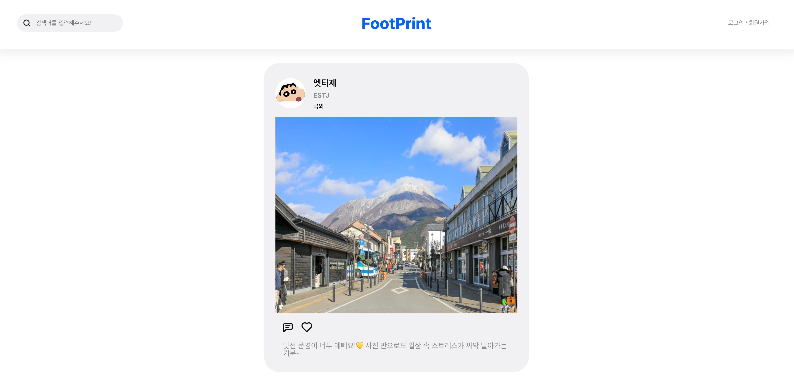

<!-- ####### 헤더 -->

# 👣 FootPrint : 여행 정보 공유 플랫폼
https://foot-print-six.vercel.app/

 

다양한 영화를 검색하고, 관심있는 영화를 북마크에 저장해 확인할 수 있는 사이트입니다.

지금 가장 뜨고있는 영화들을 실시간으로 확인할 수 있고,
모달을 통해 개봉일자, 내용 및 평점 확인이 가능합니다.
 

 
 
 
 
 

## 👫👫🚶 Team Member

<markdown-accessiblity-table data-catalyst=""><table>
  <tbody>
    <tr>
      <td align="center"><a href="https://github.com/hyerin-kang"> <b> 강혜린 </b></a> </td>
      <td align="center"><a href="https://github.com/JinchaeKim"> <b> 김진채 </b></a> </td>
      <td align="center"><a href="https://github.com/answq"> <b> 문정빈 </b></a> </td>
      <td align="center"><a href="https://github.com/Eletsia"> <b> 민정현 </b></a> </td>
      <td align="center"><a href="https://github.com/ijooha16"> <b> 윤주하 </b></a> </td>
    </tr>
  </tbody>
</table></markdown-accessiblity-table>

 
 
 
 
 

<!-- ####### 프로젝트 소개 -->

<!-- 제목 -->
## :microphone: Project Introduction
 

<!-- 기간 -->

### :heavy_check_mark: **Development Period**
2025/02/12 ~ 2025/02/18

 
<!-- 테크 스택 -->

### :heavy_check_mark: **Tech Stack**

리액트와 수퍼베이스를 사용하여 만든 프로젝트입니다.

 
 
 
 
 

<!-- ####### 프로젝트 특징 -->

<!-- 제목 -->

## :sparkles: Project Features
 

<!-- 특징 하나 -->

### :heavy_check_mark: **Supabase**

Supabase에서 제공하는 api를 이용하여 CRUD 데이터베이스 핸들링을 구현했습니다.

> - **카테고리로**를 나누어 전체, 국내, 국외로 나누어 글을 확인할 수 있습니다.
>
> - **새로운 게시물**을 로그인 하여 작성할 수 있습니다.
>
> - 사진 업로드 시에는 사용자가 선택한 사진을 확인할 수 있는 **preview 기능**을 구현했습니다.
> 
> - 자신이 작성한 게시글을 **수정 또는 삭제** 가능하도록 했습니다.
> 
> - 수정 버튼 클릭 시 수정페이지로 이동하여 **기존 내용을 변동**할 수 있습니다.
> 
> - 모달창에서는 댓글을 게시할 수 있으며 **본인이 작성한 댓글만을 수정, 삭제**할 수 있습니다.

 

<!-- 특징 둘 -->

### :heavy_check_mark: **useEffect**

useEffect를 통해 컴포넌트 라이프사이클 내에서 외부로부터 가져온 데이터를 관리했습니다.

> - 카드를 클릭하여 **상세 모달**에서 글 내용 및 댓글을 확인할 수 있습니다.
>
> - 관심있는 게시물에 **좋아요**를 클릭할 수 있습니다.

 

### :heavy_check_mark: **Authentication API**

Authentication 에서 제공하는 api를 이용하여 아래 회원 가입, 로그인을 구현했습니다.

> - 로그인이 되지 않은 상태에서는 다른 사람들의 게시글을 확인할 수 있으며 로그인, 회원가입 페이지만 이용 가능합니다.
>
> - 로그인 페이지에서 **회원가입** 버튼을 통해 사용자의 정보를 입력하고 이를 DB에 저장합니다.
>
> - 로그인 상태에서는 게시물을 작성 및 수정하며 마이페이지에서 **사용자의 정보를 확인**할 수 있습니다.

 

<!-- 특징 둘 -->

### :heavy_check_mark: **그 외 기능들**

> - 하트를 클릭하여 **좋아요를 추가 및 취소**할 수 있습니다.
>
> - 상단 검색창에서는 제목, 내용, 닉네임, mbti를 포함하여 **글을 검색**할 수 있습니다.
>
> - 게시물이 한 번에 5개씩 로드되고, 아래로 **무한 스크롤** 할 수 있습니다.

 
 
 
 
 

## :gun: Trouble Shooting

 

